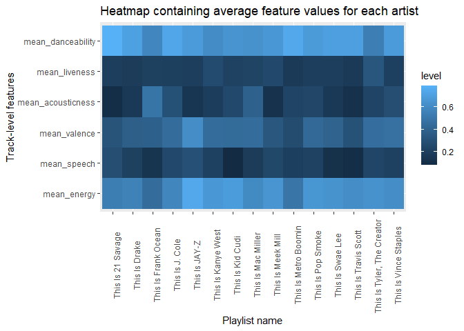
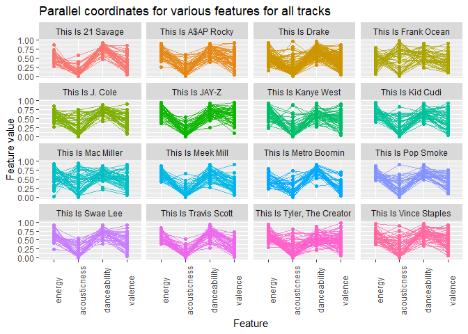
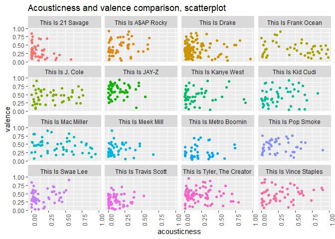

Computational Musicology 2023
================

This repository contains my course portfolio for Computational
Musicology

PLEASE DO NOT SHOW THIS PORTFOLIO IN CLASS

# My corpus

## Comparison points

For my corpus, I have decided to look into the various genres I have
listened to for the past two years using Spotify Wrapped. From what I
can see, I have listened to various genres like rock, pop, soul, media
scores et cetera. However, one of the most occuring main genres to me is
hip hop. As such, I have decided to create a corpus around rap,
specifically using the artists I have listened to the most over the past
two years.

For my corpus, I will be using the following artists:

- J. Cole
- Jay-Z
- Kid Cudi
- Kanye West
- Tyler, the Creator
- Vince Staples
- Swae Lee
- Meek Mill
- Mac Miller
- A\$AP Rocky
- 21 Savage
- Childish Gambino
- Drake
- Metro Boomin
- Travis Scott
- Pop Smoke
- Frank Ocean

For these artists, their ‘This Is’ playlists from Spotify will be used.

I would like to investigate the difference in my ‘bubble’ in which my
understanding and preference of rap songs goes, with some popular genres
that are close in similarity to rap. For this, I will use some of Every
Noise at Once’s playlists with several (sub)genres chosen from the list
based on their similarity to rap:

- southern hip hop
- conscious rap
- pop rap
- trap
- r&b
- melodic rap
- chicago rap
- g funk

The goal of this corpus is to create clusters within my corpus in order
to analyze to which subgenres or styles these rappers belong to. This is
done with the above genres as starting point, however if required,
additional genres that might provide better grouping results will be
added later.

### Representativeness of tracks

First I will handle the artist section of my corpus. I believe the
artists mentioned have created tracks for a long time, however they are
mostly skewed towards more modern releases, rather than songs from say,
before the 2000s. As such there is some lack of representation there.
Also, my list of artists only contains artist I have personally listened
to. Generally speaking, most of these artist are quite popular
worldwide, thus the section of my corpus lacks any of the less popular
artists that are not popular outside of their home country or not
popular at all.

The second part of my corpus contains playlists obtained from Every
Noise at Once. These contain socks that are much older than the first
section, thus there is a bit more representation there. Likewise, less
popular artists are also featured here. The problem of representation
from songs written in different language still exists, however and I
will likely have to look for ways to incorporate songs from other
languages as well.

## Week 7 plots

### Heatmap

First, a heatmap in order to compare the average of certain features for
the artists chosen above. The main goal is to get an idea of how the
playlists compare on average.

<!-- -->

### Parallel coordinates

Next, we dive deeper and take a look at the parallel coordinates for
each playlist

<!-- -->

### Scatter plots

From the parallel coordinates above, we can see that acousticness and
valence have the most variance. In order to further analyze this
variance, we plot both of these for every track in the corpus against
eachother in a scatterplot.

<!-- -->
